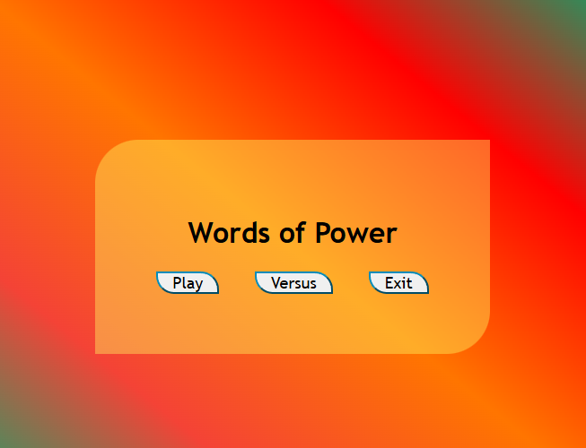
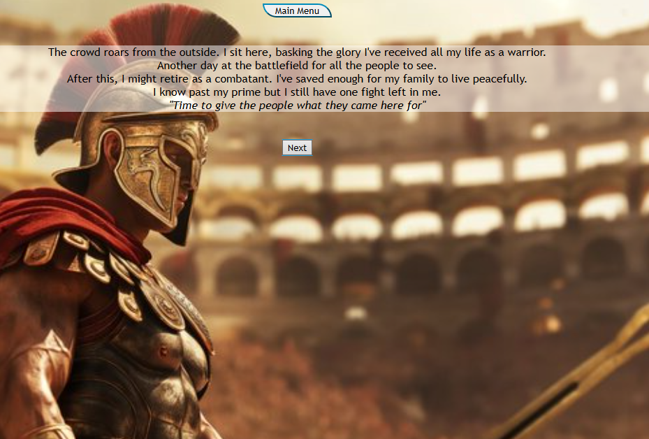
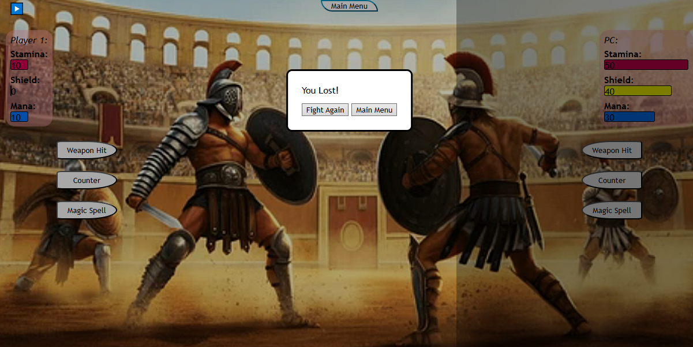

# Text Based Fighting Game
```A text based fighting game utilizing frontend languages HTML,CSS,JavaScript```

---
## Overview

This is a text based fighting game which uses frontend languages such as HTML/CSS and JavaScript in order to deeply understand the core programming fundamentals as well as game logic and narrative design  

---

## Features
- Three-Style Fighting System (Rock-Paper-Scissors)  
- 1 or 2 Player Integration  
- Short Solo Story  
- Event Interaction Between 3 Pages  


---

## Languages Used
- HTML/CSS  
- JavaScript  

## Technologies Used:
- VSCode  
- Git/GitHub  

---

## Screenshots
<p align="center">
<br/>

<br />

<br />

</p>